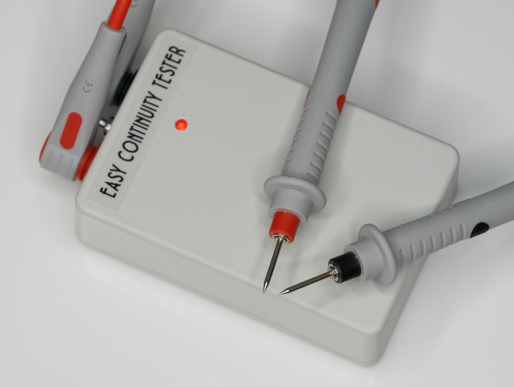
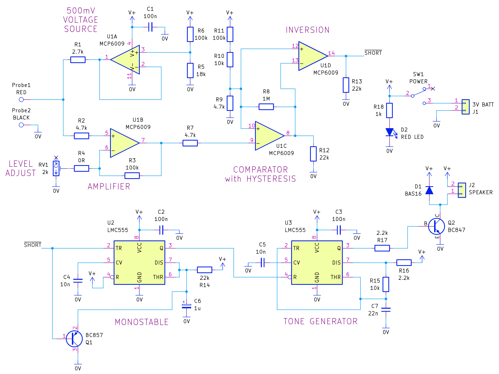
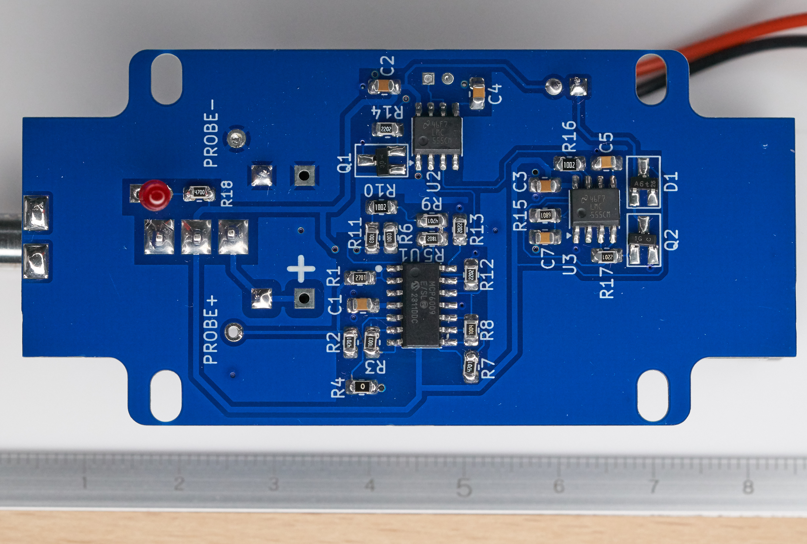
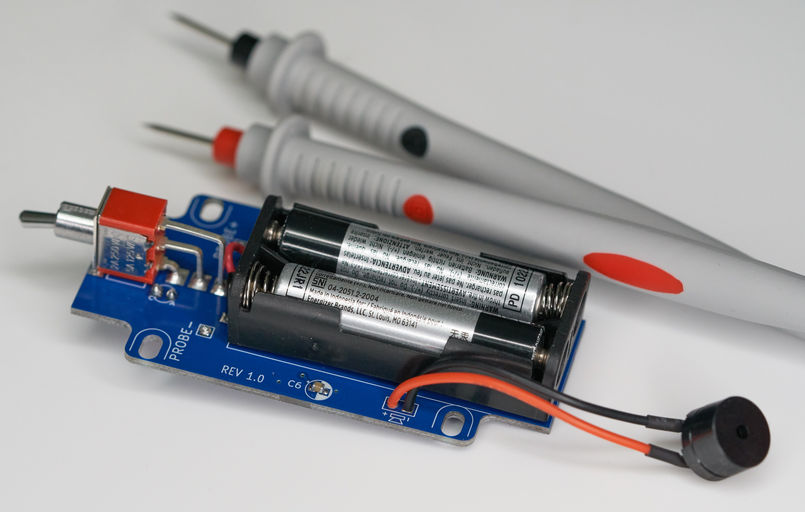

Easy Continuity Tester

A DIY continuity tester (based on reverse-engineered SF10 Short Finder).

Circuit:

To obtain the printed circuit board, upload the Gerber files (export-continuity-tester-gerbers-rev1.zip) to any PCB manufacturer.
All passives are 0805-sized (0603-sized will fit too), and all ICs are SOIC sized. The trimmer resistor is Bourns 3314G-1-202E and the enclosure is Hammond 1591XXMGY.

Here's the finished board:

It's a tight fit in the enclosure if you plan on using banana sockets. If you're going to solder test probes directly onto the PCB, then it's a very comfortable fit. Another small box is Multicomp G404; the PCB will fit that too, provided the test probes are to be directly soldered to the PCB.

